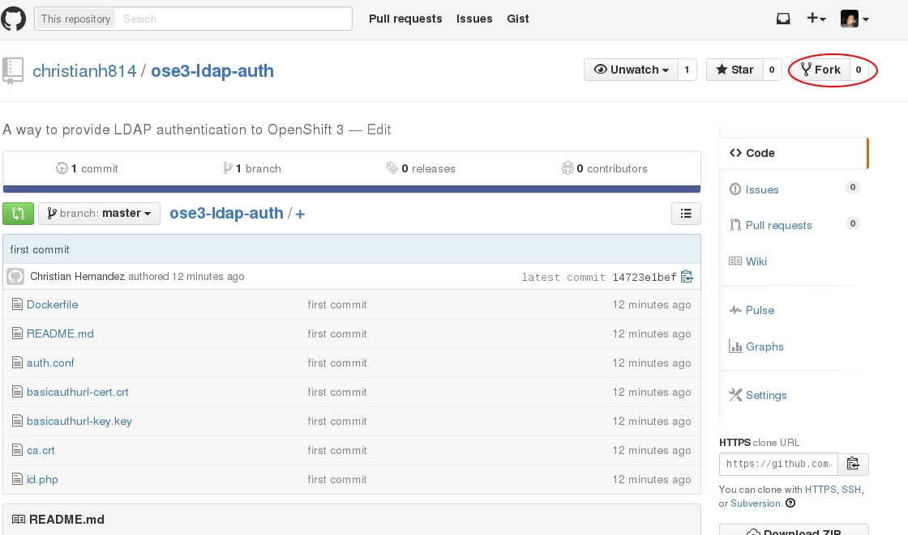

# OpenShift v3 LDAP Authentication

I'm going to assume the following.

  * You are an OSEv3 admin
  * You have a github/gitlab account (comeon they're free!)
  * Familiar with docker-build
  * All steps are being performed on the master

First, fork this repository


You'll have a repo called something like `https://github.com/<username>/ose3-ldap-auth` Clone that on your master somewhere 
```
cd /usr/local/src/
git clone https://github.com/<username>/ose3-ldap-auth
cd ose3-ldap-auth/
```

Now inside the “ose3-ldap-auth” repo; create the keys needed for TLS communications.(Also, specify the signing cert as the OSE cert and copy that CA cert). Make note of your `--hostnames` entry as this will be the name of your app when you create it!
```
root@master# cd /usr/local/src/ose3-ldap-auth

root@master# oadm create-server-cert \
--cert='basicauthurl-cert.crt' \ 
--hostnames="basicauthurl.cloudapps.example.com" \
--key='basicauthurl-key.key' \
--signer-cert=/etc/openshift/master/ca.crt \
--signer-key=/etc/openshift/master/ca.key \
--signer-serial=/etc/openshift/master/ca.serial.txt


root@master# cp /etc/openshift/master/ca.crt /usr/local/src/ose3-ldap-auth

root@master# ll
total 28
-rw-r--r--. 1 root root 1175 Jul  9 11:56 auth.conf
-rw-r--r--. 1 root root 2230 Jul  9 12:01 basicauthurl-cert.crt
-rw-------. 1 root root 1675 Jul  9 12:01 basicauthurl-key.key
-rw-r--r--. 1 root root 1066 Jul  9 12:03 ca.crt
-rw-r--r--. 1 root root  518 Jul  9 11:56 Dockerfile
-rw-r--r--. 1 root root  144 Jul  9 11:56 id.php
-rw-r--r--. 1 root root   17 Jul  9 11:56 README.md
```

Edit the `auth.conf` file to reflect your server settings 
```
# Nothing needs to be served over HTTP.  This virtual host simply redirects to HTTPS.
<VirtualHost *:80>
  DocumentRoot /var/www/html
  RewriteEngine              On
  RewriteRule     ^(.*)$     https://%{HTTP_HOST}$1 [R,L]
</VirtualHost>

<VirtualHost *:443>
  ServerAlias myapp.cloudapps.example.com
  LogLevel warn
  SSLEngine on
  SSLProtocol all -SSLv2
  SSLCipherSuite HIGH:MEDIUM:!aNULL:!MD5
  SSLCertificateFile /etc/pki/tls/certs/localhost.crt
  SSLCertificateKeyFile /etc/pki/tls/private/localhost.key
  SSLCACertificateFile /etc/pki/CA/certs/ca.crt

<ProxyMatch /oauth/token/.*>
  Allow from all
</ProxyMatch>

<Location />
  SetHandler application/x-httpd-php
  AuthName "OpenShift Enterprise"
  AuthType Basic
  AuthBasicProvider ldap
  AuthLDAPURL ldap://ipa.example.com:389/cn=users,cn=accounts,dc=example,dc=com?uid
  AuthLDAPBindDN "cn=directory manager"
  AuthLDAPBindPassword secret
  Require valid-user
</Location>

  <FilesMatch "\.(cgi|shtml|phtml|php)$">
      SSLOptions +StdEnvVars
  </FilesMatch>
  CustomLog logs/auth-ssl_request_log \
            "%t %h %{SSL_PROTOCOL}x %{SSL_CIPHER}x \"%r\" %b"
  ErrorLog logs/auth-ssl_error_log
</VirtualHost>
```

The things you want to look to edit in this file are…

  * `ServerAlias` - This **MUST** match what you put for `--hostnames=` (paramount!)
  * `AuthLDAPURL` - This is where you provide the URI of the Directory Server
  * `AuthLDAPBindDN` - The user to bind as (if you're not doing anonymous bind)
  * `AuthLDAPBindPassword` - Password of the user


Once you made these edits; add it to your forked repo 
```
root@master# cd /usr/local/src/ose3-ldap-auth
root@master# git add -A .
root@master# git commit -am "Added auth parameters"
root@master# git push
```

Now create a new project that will house the auth pod
```
root@master# oadm new-project auth --display-name="Authentican Space" --description="This is to show how Authentication works on OpenShift v3" --node-selector='region=infra'
```

Create your application using the following parameters
```
root@master# oc new-app https://github.com/<username>/ose3-ldap-auth --strategy=docker --name=basicauthurl -n auth
```

Things to note

  * `--strategy=docker` - Setting the build strategy as `docker` so that it will build a docker image
  * `-n auth` - Specifies the `auth` namespace/project

Wait a few moments and you should see a build running
```
root@master# oc get builds -n auth
NAME             TYPE      STATUS    POD
basicauthurl-1   Docker    Running   basicauthurl-1-build
```

View the logs if you'd like
```
root@master# oc build-logs basicauthurl-1 -n auth
```

You will need to tell the service which port to listen on
```
root@master# oc expose dc/basicauthurl --port=443 --generator=service/v1 -n auth
NAME           LABELS    SELECTOR                        IP(S)     PORT(S)
basicauthurl   <none>    deploymentconfig=basicauthurl             443/TCP
```

Now expose the route (the `--hostname` here **MUST** match the `--hostnames` from the `oadm` command above)
```
root@master# oc expose service basicauthurl --hostname=basicauthurl.cloudapps.example.com -n auth
NAME           HOST/PORT                            PATH      SERVICE        LABELS
basicauthurl   basicauthurl.cloudapps.example.com             basicauthurl 
```

Since we are hosting SSL within our application...we need to tell the routing layer to use `passthough` TLS. Edit the route to have `tls: terminiation: passthrough`
```
root@master# oc edit route/basicauthurl -n auth -o yaml
```

In the end,it should look something like this
```
root@master# oc get route/basicauthurl -n auth -o yaml 
apiVersion: v1
kind: Route
metadata:
  annotations:
    openshift.io/host.generated: "false"
  creationTimestamp: 2015-07-09T20:06:53Z
  name: basicauthurl
  namespace: auth
  resourceVersion: "32400"
  selfLink: /osapi/v1beta3/namespaces/auth/routes/basicauthurl
  uid: 0aee92a4-2676-11e5-a1de-525400e68df5
spec:
  host: basicauthurl.cloudapps.example.com
  tls:
    termination: passthrough
  to:
    kind: Service
    name: basicauthurl
status: {}
```

Test your application using curl and the CA cert.
```
root@master# curl --cacert /etc/openshift/master/ca.crt -u ldapuser:password123 https://basicauthurl.cloudapps.example.com/id.php
{"sub":"ldapuser"}
```

If you get back `{"sub":"ldapuser"}` that means it's working.

Now edit the `/etc/openshift/master/master-config.yaml` file (make a backup first!) with the following…
```
  identityProviders:
  - challenge: true
    login: true
    name: basicauthurl
    provider:
      apiVersion: v1
      kind: BasicAuthPasswordIdentityProvider
      url: https://basicauthurl.cloudapps.example.com/id.php
      ca: /etc/openshift/master/ca.crt
```

Restart the openshift-master service
```
root@master# systemctl restart openshift-master
```

**__NOTE__** If you put a password you'll probably want to delete the repo you forked (unless you make it "private")
